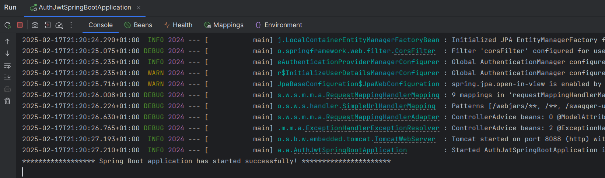
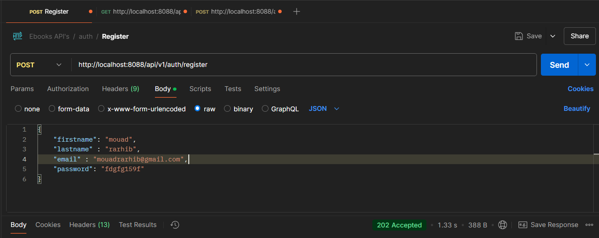
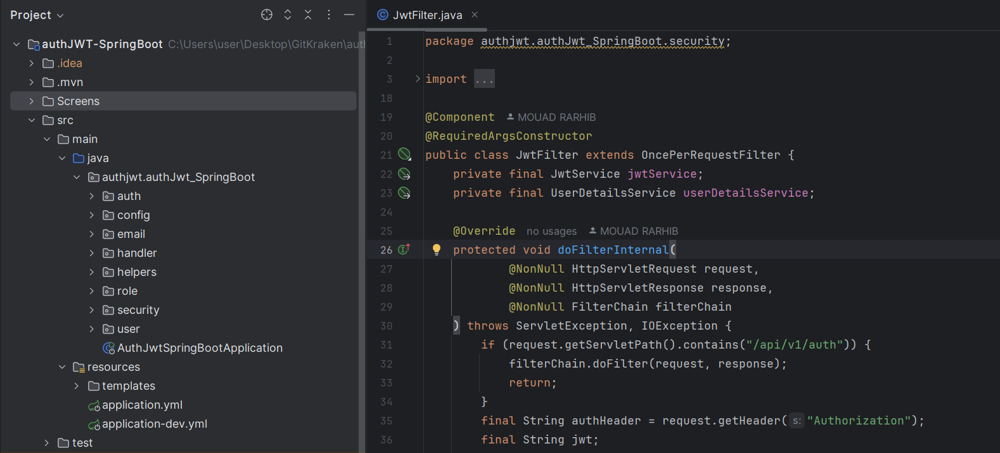
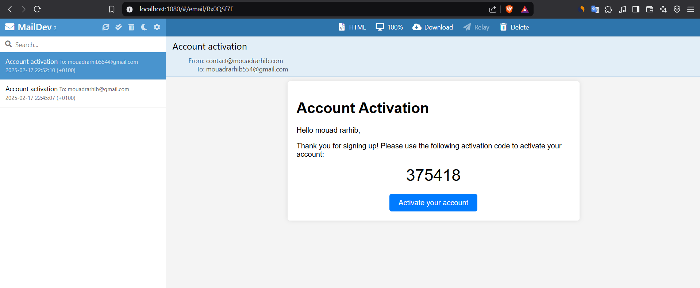
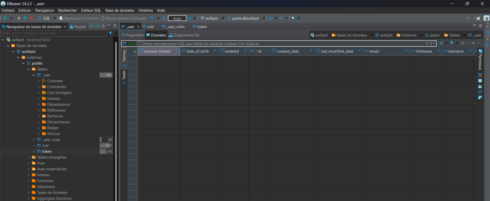

# **AuthJWT-SpringBoot** 🚀

  

---

## **Table of Contents**
1. [Overview](#overview)
2. [Features](#features)
3. [Technologies Used](#technologies-used)
4. [Project Structure](#project-structure)
5. [Dependencies](#dependencies)
6. [Setup Instructions](#setup-instructions)
7. [Docker Configuration](#docker-configuration)
8. [Screenshots](#screenshots)
---

## **Overview**

The **AuthJWT-SpringBoot** project is a robust and secure authentication and authorization system built using **Spring Boot**. It leverages **JSON Web Tokens (JWT)** for stateless authentication and provides features such as user registration, email verification, role-based access control, and global exception handling. This project serves as a foundation for building secure web applications that require advanced user management and authentication mechanisms.

---

## **Features**

- **User Authentication**: Secure login functionality powered by JWT.
- **User Registration**: Allows new users to register with validation and email confirmation.
- **Role-Based Access Control**: Supports multiple roles (e.g., Admin, User) with fine-grained permissions.
- **Email Services**: Sends confirmation emails or notifications using SMTP.
- **Global Exception Handling**: Centralized error handling ensures consistent and meaningful API responses.
- **OpenAPI Documentation**: Interactive API documentation for seamless integration.
- **Audit Logging**: Tracks user actions and entity changes with audit-aware configurations.

---

## **Technologies Used**

This project utilizes the following technologies and frameworks:

- **Spring Boot**: Backend framework for rapid development.
- **Spring Security**: Provides authentication and authorization capabilities.
- **JWT (JSON Web Tokens)**: Stateless authentication mechanism.
- **Lombok**: Reduces boilerplate code with annotations.
- **Swagger/OpenAPI**: Generates interactive API documentation.
- **Maven/Gradle**: Dependency management and build automation.
- **BCryptPasswordEncoder**: Secure password hashing.
- **CORS Configuration**: Enables communication between frontend and backend.
- **H2/MySQL**: In-memory or relational database support.
- - **Docker**: Containerization for easy deployment and testing.

---

## **Project Structure**

The project is organized into the following modules:

### 1. **`auth` Folder**
   - **`AuthenticationController`**: Handles endpoints for authentication (login, register, activate account).
   - **`AuthenticationRequest`**: Data Transfer Object (DTO) for login requests.
   - **`AuthenticationService`**: Contains business logic for authentication workflows.
   - **`RegistrationRequest`**: DTO for user registration.

### 2. **`config` Folder**
   - **`ApplicationAuditAware`**: Configures auditing for tracking entity changes.
   - **`BeansConfig`**: Defines beans for `AuthenticationProvider`, `PasswordEncoder`, and CORS settings.
   - **`OpenApiConfig`**: Configures Swagger/OpenAPI for API documentation.

### 3. **`email` Folder**
   - **`EmailService`**: Manages sending emails (e.g., account activation links).
   - **`EmailTemplateName`**: Enum for defining email templates.

### 4. **`handler` Folder**
   - **`BusinessErrorCodes`**: Defines custom error codes for business logic.
   - **`ExceptionResponse`**: DTO for standardized exception responses.
   - **`GlobalExceptionHandler`**: Handles global exceptions and returns meaningful error messages.

### 5. **`helpers` Folder**
   - **`StartupMessageRunner`**: Displays a custom message during application startup.

### 6. **`role` Folder**
   - **`Role`**: Entity representing user roles.
   - **`RoleRepository`**: Repository for managing roles in the database.

### 7. **`security` Folder**
   - **`JwtFilter`**: Filters incoming requests and validates JWT tokens.
   - **`JwtService`**: Handles JWT creation, validation, and expiration.
   - **`SecurityConfig`**: Configures Spring Security settings.
   - **`UserDetailsServiceImpl`**: Custom implementation of `UserDetailsService`.

### 8. **`user` Folder**
   - **`Token`**: Entity for account activation tokens.
   - **`TokenRepository`**: Repository for managing activation tokens.
   - **`User`**: Entity representing user data.
   - **`UserRepository`**: Repository for managing user records.

---

## **Dependencies**

The project relies on the following key dependencies:

- **Spring Boot Starter Web**: For building RESTful web applications.
- **Spring Security**: For securing the application with authentication and authorization.
- **Spring Data JPA**: For interacting with databases using JPA.
- **Spring Mail**: For sending emails via SMTP.
- **Jackson**: For JSON serialization and deserialization.
- **Lombok**: For reducing boilerplate code with annotations.
- **Swagger/OpenAPI**: For generating interactive API documentation.
- **H2/MySQL**: For in-memory or relational database support.

Add these dependencies to your `pom.xml` or `build.gradle` file.

---

## **Setup Instructions**

### **Prerequisites**
Ensure you have the following installed:
- **Java 17 or higher**
- **Maven/Gradle**
- **An IDE (e.g., IntelliJ IDEA, Eclipse)**
- **Postman** (for testing APIs)
- **Docker** (for running the application in containers)

### **Steps to Run the Project**

1. **Clone the Repository**
   ```bash
   git clone https://github.com/mouadrarhib/authJWT-SpringBoot.git
   cd authJWT-SpringBoot
2. **Set Up Database**
   ```bash
   spring.datasource.url=jdbc:mysql://localhost:3306/auth_db
   spring.datasource.username=root
   spring.datasource.password=your_password
   spring.jpa.hibernate.ddl-auto=update
3. **Build the Project**
   ```bash
   mvn clean install
4. **Run the Application**
   ```bash
   ./mvnw spring-boot:run
5. **Run the Application**
   ```bash
   ./mvnw spring-boot:run
6. **Access the Application**
   
   Swagger/OpenAPI Documentation:
   ```bash
   http://localhost:8080/swagger-ui/index.html
   ```
   API Endpoints:
   ```bash
   http://localhost:8080/api

## **Docker Configuration** 🐳

This project includes a `docker-compose.yml` file to simplify the setup of required services using Docker. The configuration defines two main services:

### **Services**

#### **PostgreSQL Database (`postgres`):**
- **Container Name**: `postgres-sql-bsn`
- **Image**: `postgres`
- **Environment Variables**:
  - `POSTGRES_USER`: Username for the database (default: `username`).
  - `POSTGRES_PASSWORD`: Password for the database (default: `password`).
  - `POSTGRES_DB`: Name of the database (default: `book_social_network`).
- **Volumes**:
  - Persistent storage for PostgreSQL data.
- **Ports**:
  - Host port `5432` maps to container port `5432`.
- **Networks**:
  - Connected to the `spring-demo` network.

#### **MailDev Email Service (`mail-dev`):**
- **Container Name**: `mail-dev-bsn`
- **Image**: `maildev/maildev`
- **Ports**:
  - Host port `1080` maps to container port `1080` (web interface for viewing emails).
  - Host port `1025` maps to container port `1025` (SMTP server for sending emails).

---

## **Screenshots**

### **1. Application Startup Message**
This message is displayed in the console when the application runs successfully.



---

### **2. Testing the `/register` API in Postman**
This screenshot shows the successful registration of a user using the `/register` API.



---

### **3. Project Structure**
This image shows the project folder structure in the IDE sidebar.



---

### **4. Email Confirmation**
This screenshot shows the email received after registration, containing the confirmation link and code.



---

### **5. Database Management in DBeaver**
This screenshot shows the database structure and data management in DBeaver.



## **Conclusion**

The **AuthJWT-SpringBoot** project is designed to provide a solid foundation for secure and scalable web applications. With its modular structure, modern technologies, and comprehensive features, it's ready to be extended and customized for your specific needs. Happy coding! 😊


